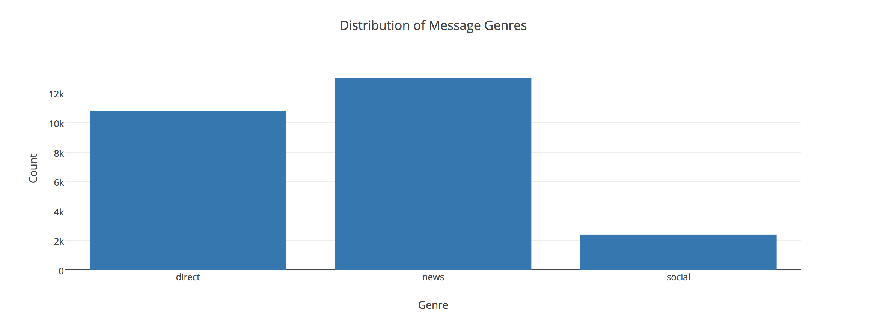
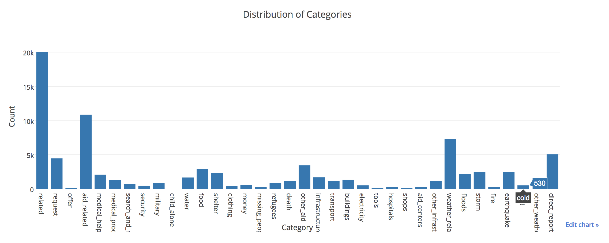
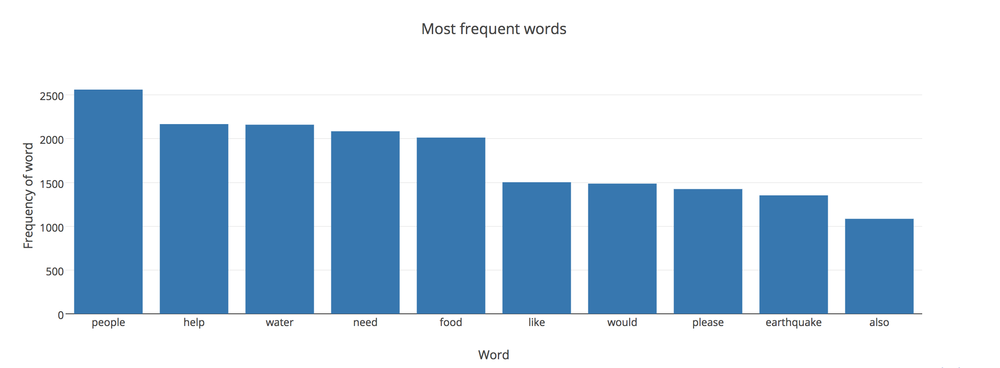

# Disaster Response Pipeline Project

## Introduction:
This is the project for classifying the disaster relief messages that are being sent to a disaster relief agency. Broadly, there are three steps involved in the complete project pipeline:
- ETL Pipeline
- ML Pipeline
- Flask Web App

### ETL Pipeline:
In a python script, `process_data.py`, there are the following steps involved:
- Load messages and categories data from `.csv` files in a dataframe.
- Merge two dataframes in a single dataframe.
- Split single `categories` column into multiple columns for MultiClass classification.
- Store the dataframe in a sqlite database.

### ML Pipeline:
In a python script, `train_classifier.py`, there are the following steps involved:
- Load data from sqlite database.
- Split data into features and target variables.
- Lemmatize and tokenize textual data using NLTK.
- Build a ML pipeline using `CountVectorizer`, `TfidfTransformer` and `AdaBoostClassifier`.
- Tune the model using GridSearch.
- Print the classification report.
- Save the classification model to a pickle file.

### Flask Web App:
In the python script, `run.py`, there are the following steps:
- Load the model from pickle file.
- Create visualizations for different categorizations:
    - Distribution of Message Genres
    
    - Distribution of Categories
    
    - Word Frequency
    

### Instructions:
1. Run the following commands in the project's root directory to set up your database and model.

    - To run ETL pipeline that cleans data and stores in database
        `python data/process_data.py data/disaster_messages.csv data/disaster_categories.csv data/DisasterResponse.db`
    - To run ML pipeline that trains classifier and saves
        `python models/train_classifier.py data/DisasterResponse.db models/classifier.pkl`

2. Run the following command in the app's directory to run your web app.
    `python run.py`

3. Go to http://0.0.0.0:3001/
